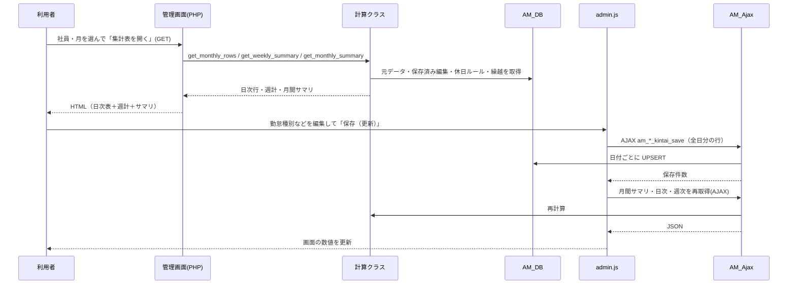

# 01 システム概要

## 1. 一言でいうと

**運送会社（有限会社たんぽぽ運送）の従業員の「月次勤怠」を、既存の打刻・運行記録データから自動で組み立て、確認・補正・集計するための WordPress 管理画面プラグイン**です。

給与計算の前段として「出勤日数・労働時間・深夜時間・確定残業時間・有給消化・休日出勤」などを社員ごと・月ごとに確定させる用途です。【推定】（コード上は計算・表示・CSV出力のみで、給与計算自体は含まない）

## 2. 解決している課題

| 課題 | このプラグインでの解決 |
|---|---|
| 勤怠データが「長距離ドライバーの運行記録」と「地場・事務の打刻」の2系統に分かれている | 両方を社員単位の月次表に統合して表示する |
| 長距離は拘束時間・運転時間・積卸時間など複雑な指標がある | 運行記録から拘束・労働・運転・積卸・休憩・深夜・日残業を自動算出する |
| 週40時間超の残業・月をまたぐ週の残業の扱いが煩雑 | 週ごとの残業を自動算出し、月末をまたぐ週は翌月へ自動繰越する |
| 日曜出勤に対する振替休の管理 | 振替休を自動割当し、不足・過不足を警告する |
| 全社員の月次を一覧で見たい／給与計算へ渡したい | 集計一覧画面とCSV出力 |
| 乗務員コードが途中で変わっても同一人物として集計したい | 社員ID基準＋乗務員コード履歴で複数コードを統合 |

## 3. 利用者と権限

### 3.1 利用者像

| 利用者 | 主な作業 |
|---|---|
| 勤怠確認担当者（事務） | 月次表の確認、勤怠種別・早退遅刻・備考の補正、保存、集計一覧の確認、CSV出力 |
| 設定担当者（管理者） | 休日ルール・職種区分・補正時間開始月の設定、拘束時間CSV取込、コード紐付け状況の確認 |
| エンジニア | 保守・改修・デプロイ |

### 3.2 権限（WordPress capability）【確定】

このプラグインは次の3つの独自 capability で制御します。**capability の定義・ロールへの付与はこのプラグインの外**（別途のロール管理）で行われます【推定】。2026-08-20 のコミット「ロール管理追加」で、それまでの `manage_options`（WordPress 管理者）から現在の独自 capability へ切り替えられました【確定】。

| capability | できること |
|---|---|
| `access_custom_plugins` | 「長距離」「地場・事務」「集計一覧」メニューの表示、閲覧用 AJAX（集計・日次・週次の再取得）、集計CSV出力 |
| `edit_custom_plugins` | **勤怠の保存**（`am_chokyo_kintai_save` / `am_jiba_kintai_save`） |
| `manage_custom_plugin_settings` | 「拘束CSV取込」「設定」メニュー、休日ルール・職種区分・補正開始月の変更、拘束CSV取込、管理画面表示時の自動DBマイグレーション |

注意点（【確定】）:
- 画面上の「保存（更新）」ボタンは `access_custom_plugins` だけで表示されます。`edit_custom_plugins` が無い利用者が押すと、保存リクエストは拒否されます（画面には「通信エラー」等が表示される可能性があります）。
- すべての AJAX は WordPress nonce（アクション名 `am_nonce`）で保護されています。

## 4. メニュー構成【確定】

WordPress 管理メニュー「**勤怠管理**」（アイコン: カレンダー、メニュー位置 28）配下:

| サブメニュー名 | ページスラッグ | 必要権限 | 画面ID（04参照） |
|---|---|---|---|
| 長距離 | `attendance-manager` | access_custom_plugins | SCR-01 |
| 地場・事務 | `attendance-manager-jiba` | access_custom_plugins | SCR-02 |
| 集計一覧 | `attendance-manager-summary` | access_custom_plugins | SCR-03 |
| 拘束CSV取込 | `attendance-manager-kousoku-import` | manage_custom_plugin_settings | SCR-04 |
| 設定 | `attendance-manager-settings` | manage_custom_plugin_settings | SCR-05 |

## 5. 業務上の3区分

| 区分 | 対象 | 主なデータ元 | 画面 |
|---|---|---|---|
| **長距離（chokyo）** | 長距離ドライバー | 拘束時間ログ `kousoku_log` ＋ 運行記録 `tenrec_daily` | 長距離 |
| **地場・事務（jiba）** | 地場ドライバー・事務員 | 打刻データ `mat_attendance_daily`（MAT プラグイン） | 地場・事務 |
| **共通設定** | 休日ルール・職種の区分・補正時間開始月 | 本プラグインの設定テーブル | 設定 |

どの職種がどの区分に表示されるかは、設定画面の「**種別管理**」（職種→区分のマッピング）で決まります。

### 日単位の「切り替え」機能（重要）
- 長距離の社員が、ある日だけ地場勤務した → 長距離画面で、その日の **「地場」スイッチ ON**。その日の時間は打刻データ（MAT）から取得されます。
- 地場・事務の社員が、ある日だけ長距離勤務した → 地場・事務画面で、その日の **「長距離」スイッチ ON**。その日の時間は運行記録（拘束時間ログ等）から取得されます。（MAT 側の長距離フラグが ON の日は自動で ON になります）

## 6. システム構成

### 6.1 コンテキスト図

```mermaid
flowchart LR
  subgraph 外部プラグイン・テーブル（読み取り専用）
    KL[(wp_kousoku_log<br/>拘束時間ログ)]
    TD[(wp_tenrec_daily<br/>運行記録の日次)]
    MAT[(wp_mat_attendance_daily<br/>打刻 / MAT API)]
    EM[(wp_emp_master<br/>社員マスタ)]
    AF[(wp_mst_affiliation<br/>所属)]
    JT[(wp_mst_job_type<br/>職種)]
    CCH[(wp_emp_crew_code_history<br/>乗務員コード履歴)]
    PL[(paid-leave-manager<br/>有給消化・付与)]
  end
  subgraph 勤怠管理プラグイン
    UI[管理画面<br/>templates + admin.js]
    AJAX[AM_Ajax]
    CC[AM_Compute_Chokyo]
    CJ[AM_Compute_Jiba]
    DB[AM_DB]
    OWN[(am_* テーブル<br/>編集内容・繰越・休日・職種区分)]
  end
  KL --> CC
  TD --> CC
  MAT --> CC
  MAT --> CJ
  KL --> CJ
  TD --> CJ
  EM --> DB
  AF --> DB
  JT --> DB
  CCH --> DB
  PL --> DB
  UI <--> AJAX
  AJAX --> CC
  AJAX --> CJ
  CC --> DB
  CJ --> DB
  DB <--> OWN
  CSVin[拘束時間CSV取込] --> KL
  CSVout[集計CSV出力] -.-> UI
```

### 6.2 外部との連携関係（このプラグインから見たもの）【確定／一部推定】

| 連携先 | 利用方法 | 備考 |
|---|---|---|
| 拘束時間管理 `wp_kousoku_log` | 乗務員コード＋日付で SELECT。CSV取込画面で INSERT/UPDATE も行う | 本プラグインが唯一書き込む外部テーブル |
| 運行記録 `wp_tenrec_daily` | 日付範囲で SELECT。`entries`（JSON）内の `driver` が社員名と一致する行を採用 | 始業・終業時刻の優先ソース（長距離） |
| 打刻（MAT）`wp_mat_attendance_daily` | 公開API `mat_get_daily_by_month()` があれば使用（MAT v3.2.0 以降）、無ければ直接 SELECT | 丸め済み始業終業・残業・深夜を取得できる |
| 社員管理（employee-manager）`wp_emp_master` ほか | 社員・所属・職種の参照。関数 `emp_get_affiliations()` / `emp_get_job_types()` / `emp_get_crew_codes_for_period()` があれば優先使用 | 無い場合は直接 SELECT でフォールバック |
| 有給管理（paid-leave-manager） | `wp_paidleave_consumptions` / `wp_paidleave_grants` を SELECT | テーブルが無い場合は「有給データなし」扱い |

### 6.3 技術スタック【確定】

- 言語: PHP（WordPress プラグイン）、JavaScript（jQuery のみ）、CSS
- DB: MySQL（WordPress の `$wpdb`）。照合順序 `utf8mb4_unicode_520_ci` を明示して JOIN する箇所がある
- ビルド工程・テストフレームワーク: **なし**
- UI: WordPress の Dashicons、独自 CSS（`assets/css/admin.css`）
- CI: 構文チェックのみ（PHP lint、`node --check`、マージコンフリクトマーカー検出）
- デプロイ: GitHub Actions → FTP（XSERVER）。詳細は 10

### 6.4 ディレクトリ構成

```
attendance-manager/
├── attendance-manager.php                  プラグイン本体（フック登録・メニュー・テーブル作成・マイグレーション）
├── includes/
│   ├── class-am-db.php                     DBアクセス（唯一のクエリ集約先）
│   ├── class-am-ajax.php                   AJAXハンドラ
│   ├── class-am-compute-chokyo.php         長距離の計算ロジック＋共通の週集計
│   ├── class-am-compute-jiba.php           地場・事務の計算ロジック
│   ├── class-am-kousoku-csv-importer.php   拘束時間CSV取込
│   └── class-am-summary-csv-exporter.php   集計CSV出力
├── templates/                              画面（PHPテンプレート）
│   ├── chokyo-page.php / jiba-page.php     日次表＋週計＋月間サマリ
│   ├── _weekly-table.php / _monthly-summary.php   共通部品
│   ├── summary-list-page.php               集計一覧
│   ├── kousoku-import-page.php             拘束CSV取込
│   └── settings-page.php                   設定
├── assets/js/admin.js                      フロント処理（jQuery）
├── assets/css/admin.css                    スタイル
├── docs/                                   ドキュメント
└── .github/workflows/                      デプロイ・検証
```

## 7. 基本動作原理（設計思想）【確定】

1. **毎回、元データから再計算する**: 画面を開くたびに、運行記録・打刻などの元データから日次の時間を計算し直す。計算結果そのものは保存しない。
2. **保存するのは「人が直した部分」だけ**: 勤怠種別（手動設定時）、振替ラベル、地場/長距離フラグ、補正時間、早退遅刻、備考。
3. **手動設定が自動判定に勝つ**: 勤怠種別を人が変更すると「手動（`is_manual`）」として保存され、以降は自動判定で上書きされない。
4. **自動判定は常に実行される**: 保存済みデータがあっても自動計算は走り、手動行だけが保護される（`CLAUDE.md` の "Has_data flag" の記述）。
5. **月をまたぐ週は自動で翌月へ繰越**: 月末時点で週が終わっていない場合、その週の途中までの集計を翌月分として DB に保存し、翌月表示時に先頭へ「前月繰越残業」行として表示する。
6. **計算コードは共通部品化**: 週集計（`_build_weekly_static`）、勤怠種別の自動補正、振替休割当は長距離・地場で共有。

## 8. 画面の処理の流れ（共通）



## 9. バージョン履歴の要点（git ログより）

| 時期 | 内容 |
|---|---|
| 2026-06-03 | v1.1.0 新規作成（長距離・地場・事務・休日マスタ） |
| 2026-06-04〜09 | 勤怠種別の自動判定・保存後の挙動修正、集計一覧ページ追加、リファクタリング |
| 2026-08-05〜18 | 地場の計算元を MAT の丸め後始業終業に切替、深夜時間を MAT API から取得、承認済み有給の消化日を自動反映 |
| 2026-08-19〜21 | 月末繰越時間の月次反映、権限を独自 capability 化（ロール管理）、振替なし法定休出勤の残業除外、MAT 打刻の長距離フラグ自動反映 |
| 2026-08-26 | 乗務員コードの複数保有対応（社員ID基準・コード履歴） |
| 2026-09-03〜16 | 月末繰越残業を月次合計へ反映、時間外深夜を深夜・残業の両方へ算入、拘束時間CSV取込（09-09）、集計CSV出力（09-11〜）（法定休日労働時間は「振替なし」のみ、長距離・郵便は点呼10分/日を加算） |
| 2026-09-29 | 補正時間（点呼など）の導入、補正適用開始月の設定、地場・事務への補正時間追加 |
| 2026-10-02 | 所定振替休の自動割当を無効化（任意運用化）、所定振替休の件数警告を復活 |
| 2026-10-05 | 集計一覧へお盆（8/13）・お正月（1/1）出勤バッジを追加 |

（現在の `Version` ヘッダは 1.2.1。機能追加後もヘッダが更新されていない可能性があります。【要確認】）
