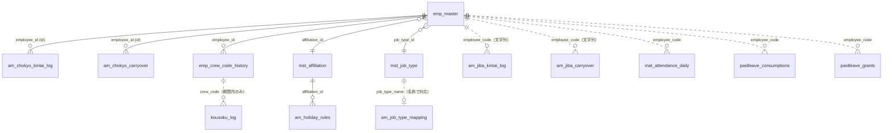

# 06 データ仕様

> テーブル名の `wp_` は WordPress のテーブル接頭辞（`$wpdb->prefix`）の例です。実環境では接頭辞が異なることがあります。

## 1. 全体像

### 1.1 所有区分

| 区分 | テーブル | 作成・変更するのは |
|---|---|---|
| **本プラグイン所有（6）** | `am_chokyo_kintai_log` / `am_chokyo_carryover` / `am_jiba_kintai_log` / `am_jiba_carryover` / `am_holiday_rules` / `am_job_type_mapping` | 本プラグイン（有効化時 `activate()`、管理画面表示時 `migrate_existing_tables()`） |
| **外部・書き込みあり（1）** | `kousoku_log`（拘束時間ログ） | 別プラグイン。**本プラグインは CSV取込画面からのみ INSERT/UPDATE する** |
| **外部・読み取り専用** | `tenrec_daily` / `mat_attendance_daily` / `emp_master` / `mst_affiliation` / `mst_job_type` / `emp_crew_code_history` / `paidleave_consumptions` / `paidleave_grants` | 各別プラグイン |
| **WordPressオプション（1）** | `am_hosei_start_month` | 本プラグイン |

### 1.2 関連図

### 1.3 キーの使い分け（重要）

| 区分 | 社員を識別するキー | 備考 |
|---|---|---|
| 長距離の保存データ | **`employee_id`**（不変の主キー）。旧データは `crew_code` で保持 | 乗務員コード変更に耐えるため |
| 地場・事務の保存データ | **`employee_code`**（社員コード） | 旧来のまま |
| 拘束時間ログ | `crew_code` + `work_date` | 期間付きコード履歴で社員と結ぶ |
| 打刻（MAT）・有給 | `employee_code` | |

## 2. 本プラグイン所有テーブル

### TBL-01 `am_chokyo_kintai_log`（長距離・勤怠編集）

人が編集した内容のみ保存（時間は保存しない）。

| 列 | 型 | NULL | 既定 | 説明 |
|---|---|---|---|---|
| `id` | INT UNSIGNED AUTO_INCREMENT | | | 主キー |
| `employee_id` | INT UNSIGNED | ○ | NULL | 社員ID（旧行は NULL。移行で補完） |
| `crew_code` | VARCHAR(20) | | | 保存時点の現行乗務員コード（監査・旧データ互換用） |
| `work_date` | DATE | | | 勤務日 |
| `kintai_type` | VARCHAR(20) | | `''` | 勤怠種別（手動行のみ有効） |
| `furikae_label` | VARCHAR(30) | | `''` | 振替ラベル（例 `09/06(日)の振替`） |
| `is_manual` | TINYINT(1) | | 0 | 1=勤怠種別を手動設定 |
| `jiba` | TINYINT(1) | | 0 | 地場フラグ |
| `hosei_min` | INT | | **10** | 補正時間（分）。マイグレーションで後から追加 |
| `hayatai_min` | INT | | 0 | 早退・遅刻（分） |
| `note` | VARCHAR(100) | | `''` | 備考 |
| `updated_at` | DATETIME | | CURRENT_TIMESTAMP ON UPDATE | |

インデックス: `PRIMARY(id)` / `UNIQUE uq_crew_date (crew_code(20), work_date)` / `KEY idx_employee_date (employee_id, work_date)`

> 注: UNIQUE は `crew_code + work_date`（旧キー）のまま。論理的な一意性は `employee_id + work_date`（アプリ側で検査。複数ヒット時は保存中断）。

### TBL-02 `am_chokyo_carryover`（長距離・月またぎ繰越）

| 列 | 型 | NULL | 既定 | 説明 |
|---|---|---|---|---|
| `id` | INT UNSIGNED AI | | | |
| `employee_id` | INT UNSIGNED | ○ | NULL | 社員ID |
| `crew_code` | VARCHAR(20) | | | 保存時点の現行コード |
| `year_month` | CHAR(7) | | | **繰越先**の月（`YYYY-MM`）。例: 9月末の繰越は `2026-10` |
| `labor_min` | INT | | 0 | 労働時間（表示用、補正含む実労働） |
| `overtime_labor_min` | INT | ○ | NULL | 週40時間判定用の労働時間（振替なし法定休出勤を除く）。**NULL の旧行は `labor_min` で代用** |
| `drive_min` | INT | | 0 | 運転 |
| `cargo_min` | INT | | 0 | 積卸 |
| `kousoku_min` | INT | | 0 | 拘束 |
| `midnight_min` | INT | | 0 | 深夜 |
| `overtime_min` | INT | | 0 | 日残業の合計 |
| `week_overtime_min` | INT | | 0 | 週残業 |
| `days` | TINYINT UNSIGNED | | 0 | 繰越対象の日数（当月側の日数）。0 なら繰越行を表示しない |
| `updated_at` | DATETIME | | | |

インデックス: `PRIMARY(id)` / `UNIQUE uq_crew_month (crew_code(20), year_month)` / `KEY idx_employee_month (employee_id, year_month)`

### TBL-03 `am_jiba_kintai_log`（地場・事務・勤怠編集）

| 列 | 型 | NULL | 既定 | 説明 |
|---|---|---|---|---|
| `id` | INT UNSIGNED AI | | | |
| `employee_code` | VARCHAR(20) | | | 社員コード |
| `work_date` | DATE | | | |
| `kintai_type` | VARCHAR(20) | | `''` | |
| `furikae_label` | VARCHAR(30) | | `''` | |
| `is_manual` | TINYINT(1) | | 0 | |
| `chokyo` | TINYINT(1) | | 0 | 長距離フラグ |
| `hosei_min` | INT | ○ | NULL | 補正時間。**NULL=既定**（長距離フラグONなら10分）。フラグOFFで保存すると NULL |
| `hayatai_min` | INT | | 0 | |
| `note` | VARCHAR(100) | | `''` | |
| `updated_at` | DATETIME | | | |

インデックス: `PRIMARY(id)` / `UNIQUE uq_emp_date (employee_code(20), work_date)`（UPSERT のキー）

### TBL-04 `am_jiba_carryover`（地場・事務・月またぎ繰越）
列は TBL-02 と同じ（`employee_id` / `crew_code` の代わりに `employee_code VARCHAR(20)`）。
インデックス: `UNIQUE uq_emp_month (employee_code(20), year_month)`

### TBL-05 `am_holiday_rules`（所定休日ルール）

| 列 | 型 | NULL | 説明 |
|---|---|---|---|
| `id` | INT UNSIGNED AI | | |
| `affiliation_id` | INT UNSIGNED | | 所属ID（`mst_affiliation.id`） |
| `day_of_week` | TINYINT | | 曜日（0=日,1=月,…,6=土） |
| `week_numbers` | VARCHAR(20) | | 月内の第何回か（カンマ区切り。例 `2,4`） |
| `is_active` | TINYINT(1) | | 1=有効（既定1） |
| `updated_at` | DATETIME | | |

インデックス: `UNIQUE uq_affil_rule (affiliation_id, day_of_week, week_numbers)`

### TBL-06 `am_job_type_mapping`（職種→画面区分）

| 列 | 型 | 説明 |
|---|---|---|
| `id` | INT UNSIGNED AI | |
| `job_type_name` | VARCHAR(50) | 職種名（`mst_job_type.name` と文字列一致） |
| `category` | VARCHAR(10) | `chokyo` または `jiba`（既定 jiba） |
| `updated_at` | DATETIME | |

インデックス: `UNIQUE uq_job_type (job_type_name)`。保存は `INSERT ... ON DUPLICATE KEY UPDATE`。

### 補足: テーブル作成・変更の仕組み【確定】
- **有効化フック** `activate()`: 上記6テーブルを `dbDelta(CREATE TABLE IF NOT EXISTS ...)` で作成。
- **管理画面を開くたび**（`admin_init`、権限 `manage_custom_plugin_settings` を持つ利用者のときのみ）`migrate_existing_tables()`:
  1. テーブルが1つでも無ければ `activate()` を再実行
  2. 繰越テーブルに `overtime_labor_min` 列が無ければ追加
  3. オプション `am_hosei_start_month` が未設定なら**今月**で作成（導入月以前の集計を変えないため）
  4. `am_chokyo_kintai_log.hosei_min`（INT NOT NULL DEFAULT 10）／`am_jiba_kintai_log.hosei_min`（INT NULL）を追加
  5. 長距離の2テーブルに `employee_id` 列とインデックスを追加し、旧行へ `employee_id` を補完（`migrate_chokyo_employee_ids`）
- 補完ロジック: `emp_crew_code_history` があれば「その行の `crew_code` が、勤務日（繰越は月）に有効な履歴に**ただ1人の社員**だけ一致する場合のみ」`employee_id` を設定。履歴テーブルが無い旧構成では、`emp_master.crew_code` が一意に決まる場合のみ設定。**曖昧な行は更新しない**。
- 補完・衝突の件数は設定画面の「未紐付け乗組員コード」セクションに表示（`AM_DB::get_crew_migration_status`）。

## 3. WordPress オプション

| オプション名 | 値 | 意味 | 変更方法 |
|---|---|---|---|
| `am_hosei_start_month` | `YYYY-MM` | 補正時間の適用開始月 | 設定画面（API-15）。初回は導入月が自動設定 |

不正値のときは当月として扱う（`AM_DB::get_hosei_start_month`）。

## 4. 外部テーブル（このプラグインが読む列・書く列）

> 外部テーブルの完全な定義は各プラグインの責務です。ここでは**本プラグインが参照する範囲**を示します。

### 4.1 `kousoku_log`（拘束時間ログ）

乗務員コード×日付で1行（`UNIQUE(crew_code, work_date)` を前提とした UPSERT SQL が同梱されている。【確定】）。CSV取込で扱う全27列:

| 列 | CSV日本語見出し | 意味 | 本プラグインの計算で使用 |
|---|---|---|---|
| `id` | （ひな形には無し） | 主キー | – |
| `crew_code` | 乗務員コード | | ○ キー |
| `work_date` | 日付 | | ○ キー |
| `start_time` | 始業時刻 | TIME | ○ |
| `end_time` | 終業時刻 | TIME（日またぎは `end_next_day` で表現、24:00以上は不可） | ○ |
| `end_next_day` | 終業翌日フラグ | 0/1 | ○ |
| `drive_min` | 運転時間（分） | | ○ |
| `drive_overlap_min` | 重複運転時間（分） | | – |
| `cargo_min` | 荷役時間（分） | 画面の「積卸時間」 | ○ |
| `cargo_overlap_min` | 重複荷役時間（分） | | – |
| `break_min` | 休憩時間（分） | | –（画面の休憩は差し引き算出） |
| `break_overlap_min` | 重複休憩時間（分） | | – |
| `kousoku_subtotal_min` | 拘束時間小計（分） | | – |
| `kousoku_overlap_min` | 重複拘束時間小計（分） | | – |
| `kousoku_total_min` | 拘束時間合計（分） | | –（拘束は始業終業から再計算） |
| `kousoku_cumul_min` | 拘束時間累計（分） | | – |
| `drive_avg_before_min` | 前運転平均（分） | | – |
| `drive_avg_after_min` | 後運転平均（分） | | – |
| `rest_min` | 休息時間（分） | | – |
| `actual_work_min` | 実働時間（分） | | – |
| `overtime_min` | 時間外時間（分） | | ○ |
| `midnight_min` | 深夜時間（分） | | ○ |
| `overtime_midnight_min` | 時間外深夜時間（分） | | ○ |
| `remarks1` / `remarks2` | 摘要1 / 摘要2 | | – |
| `created_at` / `updated_at` | （ひな形には無し） | | – |

### 4.2 `tenrec_daily`（運行記録の日次）

| 列 | 使用方法 |
|---|---|
| `ymd` | `YYYYMMDD` 文字列。月の範囲で `BETWEEN` 取得 |
| `entries` | JSON 配列。各要素に `driver`（社員名）、`g1_time`（始業）、`g3_time` / `g5_time` / `g7_time`（以降の時刻。終業は g7→g5→g3 の最後の値）が入る。**`driver` が社員名と完全一致する最初の要素**を採用 |

### 4.3 `mat_attendance_daily` と MAT 公開API
- 公開API `mat_get_daily_by_month( 社員コード, 'YYYY-MM' )` が存在すれば**そちらを優先**（MAT v3.2.0 以降）。日付キーの連想配列を返す想定で、次のキーを使用:
  `clock_in` / `clock_out` / `rounded_clock_in` / `rounded_clock_out` / `kousoku_minutes` / `labor_minutes` / `break_minutes` / `overtime_minutes` / `midnight_minutes` / `long_distance`
- API が無い場合は直接 SELECT: `work_date, clock_in, clock_out, break_minutes`（地場・事務は `SELECT *` で `long_distance` も参照）。社員一覧のフォールバックでは `employee_code` の DISTINCT を使用。

### 4.4 社員関連

| テーブル / 関数 | 使用列・用途 |
|---|---|
| `emp_master` | `id`, `name`, `employee_code`, `crew_code`, `affiliation_id`, `job_type_id`, `is_active` |
| `mst_affiliation` | `id`, `name`, `is_active`, `sort_order`（休日マスタの所属選択・チップ表示） |
| `mst_job_type` | `id`, `name`（種別管理の職種一覧） |
| `emp_crew_code_history` | `employee_id`, `crew_code`, `valid_from`, `valid_to`, `is_current`（無ければ `emp_master.crew_code` へフォールバック） |
| 関数 `emp_get_affiliations()` / `emp_get_job_types()` / `emp_get_crew_codes_for_period()` | 社員管理プラグインが提供していれば優先使用 |

### 4.5 有給管理

| テーブル | 使用列 |
|---|---|
| `paidleave_consumptions` | `employee_code`, `consumed_date`, `consumed_days`（月合計・日付別） |
| `paidleave_grants` | `employee_code`, `is_expired`, `expiry_date`, `remaining_days`（現在有効な残の合計） |

## 5. 照合順序（コレーション）に関する注意【確定】
他プラグインのテーブルと文字列で JOIN する SQL では、`COLLATE utf8mb4_unicode_520_ci` を明示している（`crew_code` / `employee_code` の比較）。照合順序の異なるテーブルが混在する環境でのエラー回避のため。

## 6. データのライフサイクル

| データ | 作られるタイミング | 更新・削除 |
|---|---|---|
| 勤怠編集（TBL-01/03） | 利用者が「保存（更新）」したとき（**表示月の全日分**が UPSERT される） | 同日の再保存で上書き。**削除機能は無い** |
| 繰越（TBL-02/04） | **月末をまたぐ週を計算したとき**（画面表示・集計一覧・CSV出力・保存後再取得）に翌月分を UPSERT | 計算のたびに上書き。削除機能は無い |
| 休日ルール（TBL-05） | 設定画面の保存 | 編集・有効/無効切替・削除 |
| 職種マッピング（TBL-06） | 設定画面でラジオを選んだ即時 | 区分の変更のみ（**解除・削除はできない**＝一度設定すると「未設定」へ戻せない） |
| 拘束時間ログ（外部） | 別システム、またはCSV取込 | CSV取込の上書きモード |

## 7. 注意すべきデータ上の仕様

1. `am_chokyo_kintai_log` の UNIQUE が旧キー（crew_code+work_date）のため、**同一社員が複数コードを使った場合、同日に最大コード数分の行が存在し得る**。アプリ側が検出し、保存時はエラー（E2）で自動保存を拒否する。
2. 繰越テーブルの `year_month` は**繰越先**の月。読み出し側は「表示月」でキーする。
3. 繰越の `days` が 0 のとき、繰越の数値は週計算に**一切使われない**（`carry_days > 0` のときのみ）。
4. 保存済みの `kintai_type` は `is_manual = 0` のとき無視されるため、DB上の値が画面と一致しないことがある。
5. 補正時間: 長距離は NOT NULL 既定10（無効日も10が保存され得る）、地場は NULL 許容（長距離フラグOFFは NULL）。
